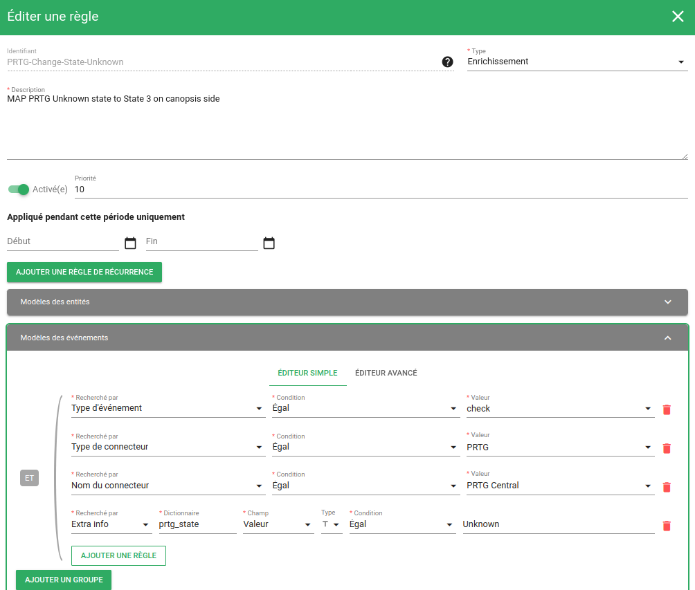
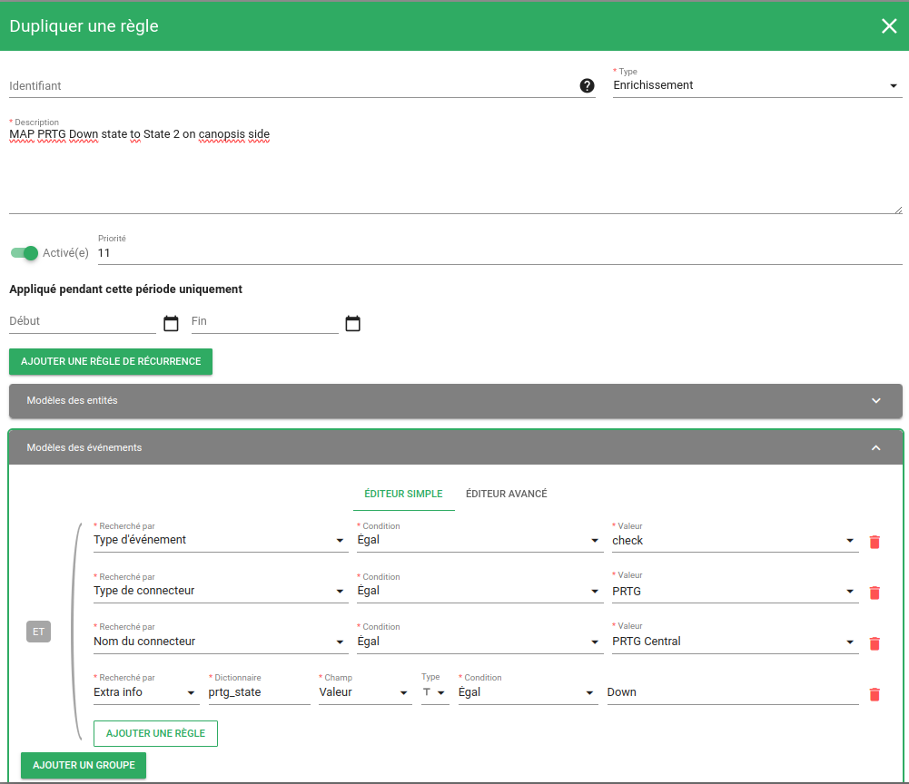

# Connecteur PRTG

## Description

Convertit les alertes de PRTG en évènements Canopsis

## Principe de fonctionnement

Les notifications de PRTG peuvent être configurées afin d'effectuer une action HTTP.

En utilisant les [placeholders](https://kb.paessler.com/en/topic/373-what-placeholders-can-i-use-with-prtg) fournis par PRTG nous pouvons contruire un paquet qui sera ensuite envoyé à l'API de Canopsis

Les statuts renvoyés par PRTG ne sont pas dans le format attendu par Canopsis et seront transformés en utilisant des règles d'enrichissement.

### Traduction des états

La traduction des états entre PRTG et Canopsis est la suivante :

| PRTG (FR)          | PRTG (EN)      | Canopsis     |
|--------------------|----------------|--------------|
| Erreur             | Down           | MAJOR (2)    |
| Avertissement      | Warning        | MINOR (1)    |
| Inhabituel         | Unusual        | MINOR (1)    |
| Erreur (partielle) | Down (Partial) | MAJOR (2)    |
| OK                 | Up             | INFO (0)     |
| Inconnu            | Unknown        | CRITICAL (3) |

Ces correspondances sont données à titre indicatif, lors de la création des règles d'enrichissement vous pourrez choisir les correspondances que vous souhaitez utiliser.

## Configuration de PRTG

Cet exemple de configuration est fait avec une interface utilisateur de PRTG en français. Si votre PRTG est dans une autre langue vous devez adapter les exemples donnés en conséquence.

Il faut tout d'abord `Ajouter un modèle de notification` depuis le menu `Modèles de notifications`


Dans la partie `Paramétrages de base` donnez un nom à votre modèle.

Dans la partie `Résumé des notifications` cochez la puce `Toujours aviser le plus tôt possible, ne jamais résumer`

Il faudra ensuite cocher le bouton `Exécuter une action HTTP` et remplir les champs comme ci-dessous : 


Le champ `cargaison` est le suivant :

```
event_type=check&connector=PRTG&connector_name=PRTG&component=%host&resource=%shortname&source_type=resource&state=3&prtg_state=%laststatus&output=%message
```

Il ne vous reste plus qu'à utiliser ce modèle dans vos `Déclencheurs de notifications`


## Configuration de Canopsis

Maintenant que PRTG envoie ses alertes vers Canopsis il faut les enrichir afin qu'elles puissent être correctement traitées par Canopsis.

Il faut pour cela créer une première règle d'enrichissment qui permet de sauvegarder un attribut spécifique à PRTG dans l'entitié Canopsis visée par l'alarme. 

Pour cela il faut se rendre sur le menu 'Exploitation' -> 'Filtres d'événements' -> 'Créer une règle' ( en lui attribuant une priorité : `10` par exemple )

Cette règle va contenir un pattern/filtre d'évènement permettant de détecter les alertes envoyées par PRTG de type `Unknown`.



Dans notre exemple, le statut `Unknown` de PRTG doit devenir une criticité `3/Critical` dans Canopsis. 


Une fois ce type de règle créée, nous validons que les évènements `Unknown` de PRTG deviennent bien des alarmes `3/Critical` dans Canopsis


Il faut ensuite définir l'ensemble des règles réalisant les transformations des états PRTG vers les états connus par Canopsis.

Pour cela, il est possible de dupliquer les règles pour gagner du temps lors de l'élaboration de celles-ci :

Chaque règle doit avoir une priorité supérieure à la règle précédente ( ici nous utiliserons la priorité `11`) pour faire correspondre le statut `Down` de PRTG en une criticité `2/Major` dans Canopsis




