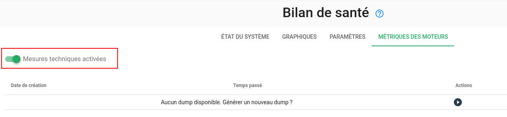
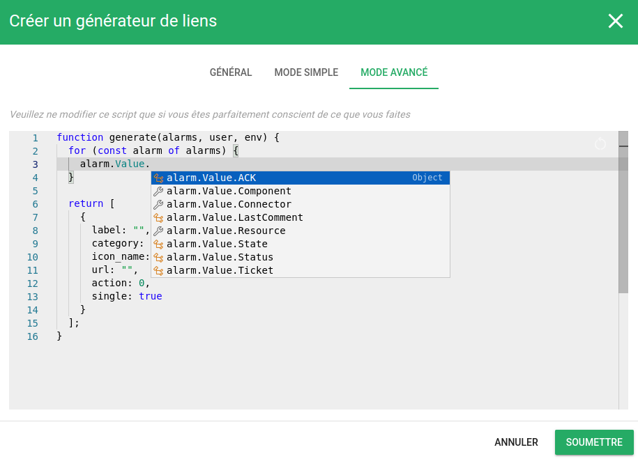

# Notes de version Canopsis 24.10.0

Canopsis 24.10.0 a été publié le 31 octobre 2024. 

## Procédure d'installation

Suivre la [procédure d'installation de Canopsis](../guide-administration/installation/index.md).

## Procédure de mise à jour

Canopsis 24.10.0 apporte des changements importants tant au niveau technique que fonctionnel.  
À ce titre, le [Guide de migration vers Canopsis 24.10.0](migration/migration-24.10.0.md) doit obligatoirement être suivi pour les installations déjà en place.

## Changements entre Canopsis 24.04 et 24.10

### WebuiAMQP2TTY

Canopsis met à disposition une version graphique de l'outil [Amqp2tty](../../../guide-de-depannage/amqp2tty).
La commande ̀`amqp2tty` permet d'afficher sur une console les événements bruts présents dans le bus de données RabbitMQ avant transformation par Canopsis.

## Environnement des Métriques Techniques activé par défaut

La fonctionnalité [Métriques Techniques](../../guide-de-depannage/metriques-techniques) est désormais intégrées aux environnements de référence.  
Cela signifie que les configurations incluent la création de la base de données et de l'utilisateur associé.  
L'activation même de la fonctionnalité s'effectue via l'interface graphique.

## Outil de support

Lorsqu'un cas de support se présente sur un environnement Canopsis, plusieurs pistes peuvent être explorées.
Il vous est alors demandé de consulter

* Les logs des moteurs
* Les dernières modifications réalisées au niveau des règles de gestion (comportements périodiques, règles d'eventfilter, scénarios, etc.)
* Des données en base
* L'état des files d'attentes du bus RabbitMQ
* D'autres éléments

Canopsis met désormais à disposition un outil d'aide au support dont les premières fonctionnalités sont :

* Export de données MongoDB et TimescaleDB
* Export des Métriques techniques
* Export de métriques spécifiques à RabbitMQ
* Visualisation des données exportées sous forme de dashboards Grafana

La documentation est à retrouver sur [cette page](../../guide-de-depannage/outil-de-support/).

## Générateurs de liens

Dans les règles de génération de liens, vous avez la possibilité d'utiliser un éditeur de code JavaScript pour les cas qui ne peuvent pas être couverts par le mode "simple".  
L'éditeur avancé de code propose à présent des suggestions de variables pour les objets suivants :

* **alarm** : toutes les variables associées à l'alarme ciblée par le générateur de liens. Cela inclut également les variables `alarm.Entity.xx` et `alarm.ExternalData.xx`.
* **user** : les variables liées à l'utilisateur qui exécute le générateur de liens.
* **env** : toutes les variables d'environnement référencées dans le [fichier toml](../../../guide-administration/administration-avancee/modification-canopsis-toml/#section-canopsistemplatevars).

### Montées de version 

Les outils suivants bénéficient de mises à jour :

| Outil       | Version d'origine | Version en 24.04    |
| ----------- | ----------------- | ------------------- |
| MongoDB     | 7.0.8             | 7.0.14              |
| TimescaleDB | 2.14.2            | 2.15.1              |
| PostgreSQL  | 13                | 15                  |

Les instructions pour leur mise à jour sont précisées dans le [guide de migration](migration/migration-24.10.0.md).

### Améliorations

*  **Général :**
    * Les unités acceptées pour les métriques sont à définir dans le fichier de configuration canopsis.toml (#5467)
    * Ajout d'un mécanisme de nommage unique d'une instance Canopsis. Ce nom est visible dans le tooltip du logo Canopsis (#5604)
    * La fonctionnalité des "métriques techniques" est à présent activable/désactivable depuis le module Healthcheck (#5584)
    * L'environnement de référence livré avec Canopsis propose un exemple de fichier de surcharge du fichier `canopsis.toml` commenté (#5657)
*  **UI :**
    * Le titre de l'application peut à présent être défini via un éditeur HTML (#5387)
    * Mise à disposition de la fonctionnalité "Enregistrement d'événements" (#5098)
    * Ajout d'options d'affichage pour le helper handlebar "tags" (#5622)
    * Ajout d'un helper handlebars "map" permettant d'afficher des clés valeurs sous forme de badges (#5365)
    * Le type "default_active" peut à présent être masqué (#5508)
    * Le formulaire de création d'un utilisateur active l'utilisateur par défaut (#4778)
    * La vue SQL `perf_data_name` a été remplacée par une table en vue d'améliorer des temps de calculs très consommateurs (#5494)
    * **Bac à alarmes**
        * Il est à présent possible d'exporter une sélection d'alarmes en CSV (#5556)
        * La corrélation dans le bac à alarmes peut à présent être activée par défaut (#5545)
        * Ajout d'un action permettant de définir un comportement périodique rapidemment (#5468)
    * **Météo des services**
        * Possibilité de paramétrer le comportement des tuiles lorsqu'aucune action n'est requise (comprendre lorsque toutes les alarmes ont été acquittées) (#5470)
        * Un droit spécifique régit la capacité de déclarer un ticket depuis le widget "Météo des services" (#5486)
    * **Compteur**
        * Le compteur "Unack" est disponible dans la liste des compteurs (#5561)
    * **Scenarios**
        * Ajout des actions de type "Unsnooze" et "Pbehaviorremove" dans le module scénario (#5077)
        * Dans un template de scénario ou de règle de déclaration de ticket, les informations d'entités des alarmes conséquences d'une méta alarme sont utilisables dans le payload (#5635)
    * **Générateur de liens**
        * Les variables d'environnement peuvent être utilisées dans le mode avancé des règles de génération de liens (#5621)
        * Des suggestions de variables sont à présent proposées dans l'éditeur avancé (#5621)
    * **Patterns**
        * L'éditeur de filtres peut agir sur les méta alarmes (#5532)
        * Les valeurs de types d'événements ne sont plus traduites pour éviter des confusions (#5507)
    * **Comportements périodiques**
        * Ajout de la possibilité de prédéfinir le nom des comportements périodiques (#5469)
    * **Healthcheck**
        * Tous les types d'événements peuvent être sélectionnés dans les graphs du moteur fifo (#5643)
    * **Règles de méta alarmes**
        * La date de dernière modification des règles de méta alarmes est mise à jour correctement (#5528) 
*  **Moteurs :**
    * Ajout d'un fonction "strjoin" dans les templates GO (#5566)
    * **Correlation**
        * Il est à présent possible de conditionner la création de méta alarmes à l'activation des alarmes qui matchent le pattern (#5529)
        * Correction d'un bug qui permettait à des alarmes d'être attachées à des méta alarmes déjà cloturées (#5573)
    * **Comportements périodiques**
        * Les comportements périodiques concernants les méta alarmes sont à présent appliqués dès leur création (#5605)
*  **Connecteurs :**
    * **SNMP**
        * Le testeur de trap "traptester.py" affiche désormais l'événement traduit au lieu de l'événement brut type trap (#5613)
*  **Documentation :**
    * [Enregistrements d'événements](../../guide-utilisation/menu-administration/enregistrements-d-evenements/)
    * [Outil de support](../../guide-de-depannage/outil-de-support/)
    * [Helpers Handlebars](../../guide-utilisation/interface/helpers/)
    * [Templates GO](../../guide-utilisation/templates-go/)
 

### Corrections de bugs

*  **UI :**
    * Correction d'un bug qui permettait de consulter un menu de l'interface même avec un token invalide (#5629)
    * **Bac à alarmes**
        * Les dates de lancement des remédiations sont à présent correctement affichées dans l'onlget "remédiation" lorsqu'une alarme est dépliée (#5669)
    * **Météo des services**
        * Correction d'un bug qui entrainait un calcul erroné de compteurs de comportements périodiques sur les tuiles de météos de service (#5606)
        * Correction d'un bug qui empêchait de changer le nombre d'items par page de la modale des météos de services (#5655)
    * **Compteur**
        * Correction du template par défaut du widget "Compteur" qui affichait une balise "center" (#5589)
    * **Comportements périodiques**
        * Correction d'un bug qui entrainait une erreur de calcul des compteurs d'alarmes (compteur négatif notamment) dans le tableau des comportements périodiques (#5652)
    * **Remédiation**
        * Correction de certains calculs de KPI pour les remédiations (#5658)
*  **Moteurs :**
    * Correction d'un bug qui entrainait une erreur de calcul de durée active/inactive d'alarmes dans certaines situations (#5602)
    * **CHE**
        * Correction d'un bug qui empêchait les règles d'enrichissement d'utiliser des "ComponentInfos" qui avait été importées par l'outil import-context-graph (#5640)
    * **Action**
        * Correction d'un bug qui empêchait les actions scénario de type "comportement périodique" d'être exécutées plusieurs fois (#5599)
    * **SNMP**
        * Correction d'un bug qui présentait à tort le moteur SNMP en KO dans le module de healthcheck (#5607)
